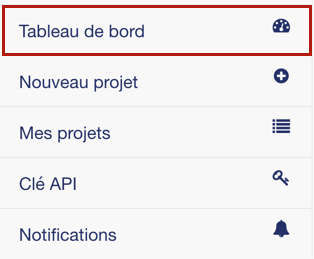
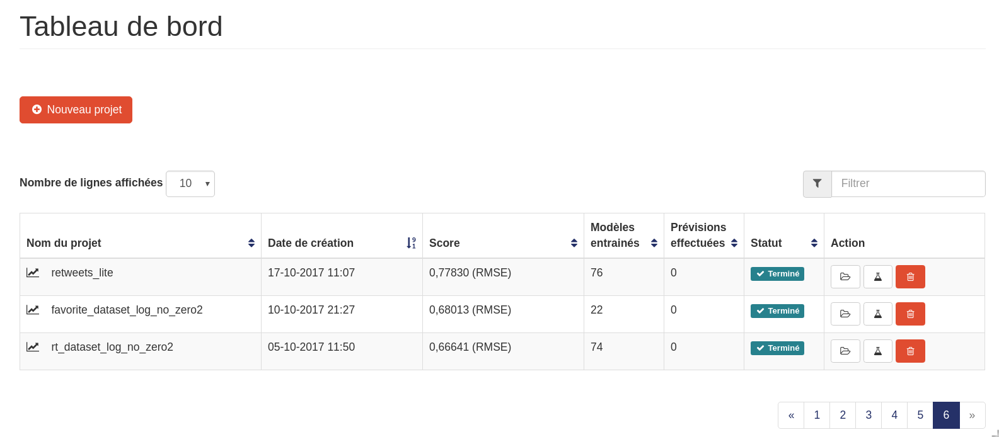

===============
Tableau de bord
===============

Le tableau de bord vous permet de suivre l’ensemble des projets que vous avez créé. Vous pouvez y
accéder en cliquant sur le bouton :

Celui-ci est composé d’un bouton permettant de créer un nouveau projet, et si des projets sont déjà créés,
ils sont alors groupés dans un tableau détaillant différentes informations
pour chacun d'eux. Il est à noter que les noms des projets sont cliquables et vous ramènent sur la
partie « Mes projets », directement sur le projet choisi.

Sur chaque ligne, le tableau contient :

* Une icône indiquant si le projet est une classification, une régression ou une multi-classification
* Le nom du projet, cliquable redirigeant vers la page du projet
* La date de création
* Le score actuel ainsi que la métrique qui est optimisée
* Le nombre de modèles entraînés
* Le nombre de prévisions effectuées
* Le statut (en cours ou terminé)
* Des actions liées au projet :

    * Ouvrir le projet
    * Faire des prévisions
    * Arrêter / Supprimer le projet (dépend du statut du projet)
