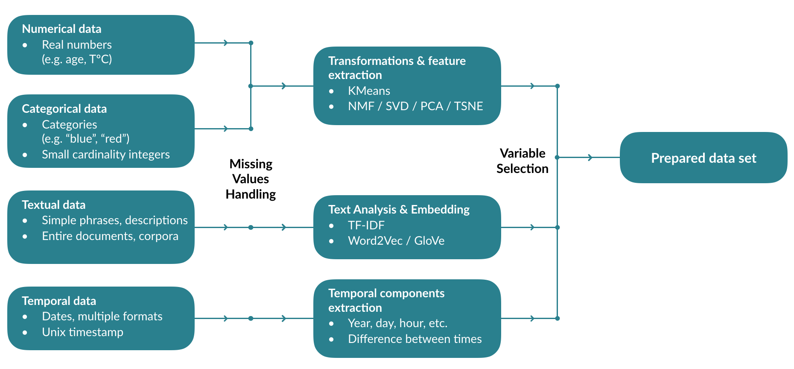
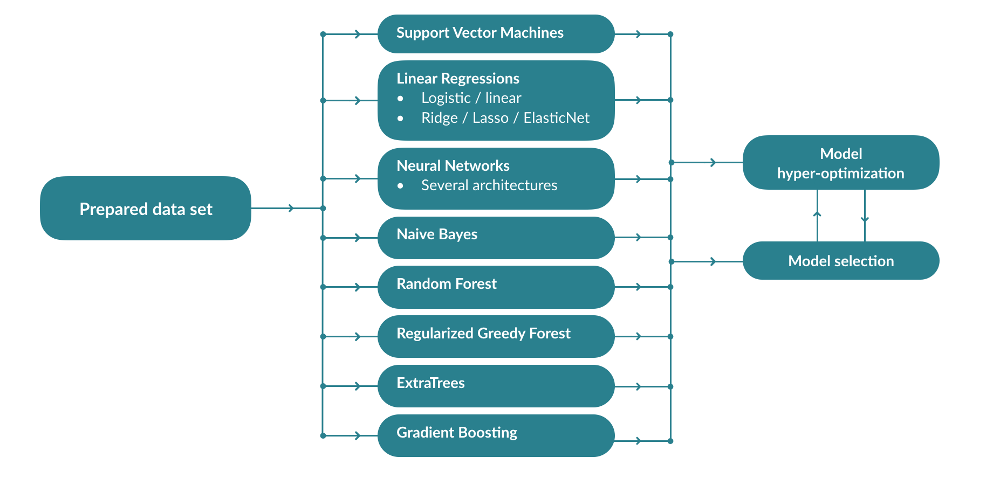
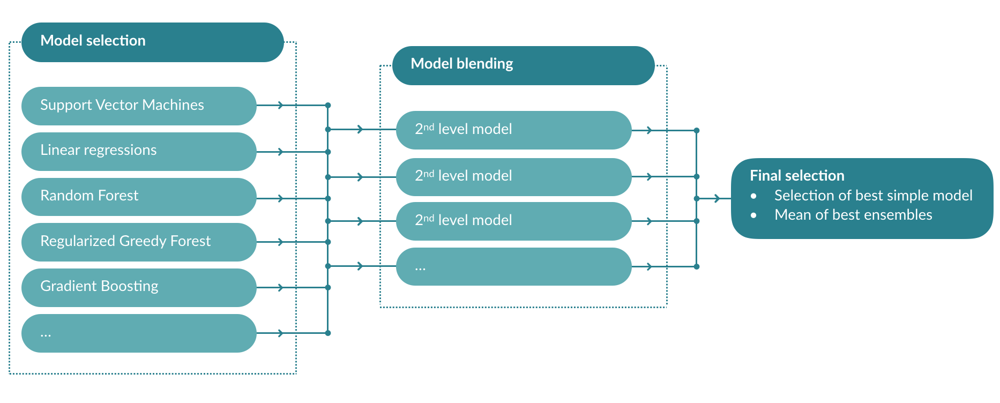
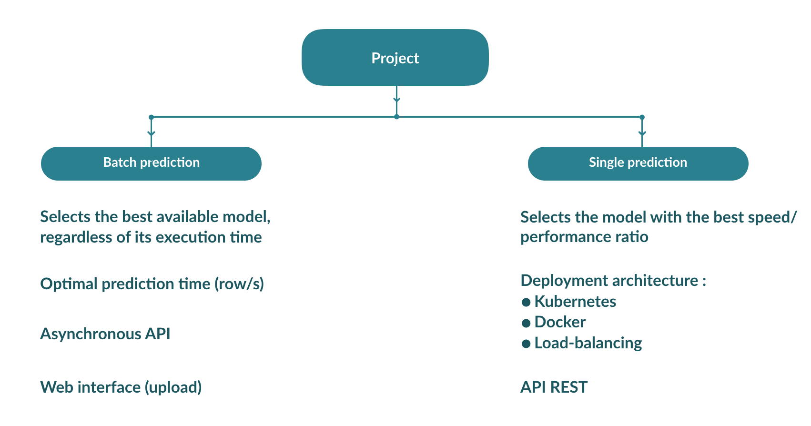

===================
Comment ça marche ?
===================

Préparation des données
------------------------

Entraînement des modèles
------------------------

Création d'ensembles
--------------------

Déploiement des modèles
-----------------------

