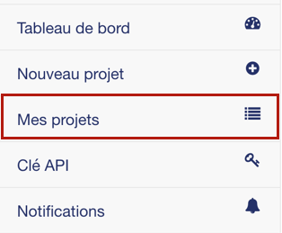
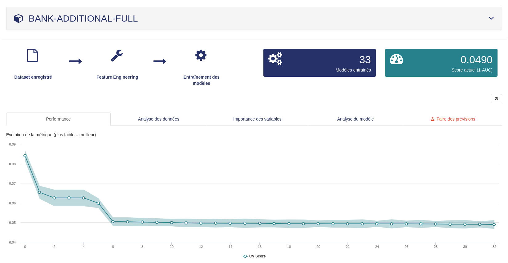
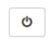
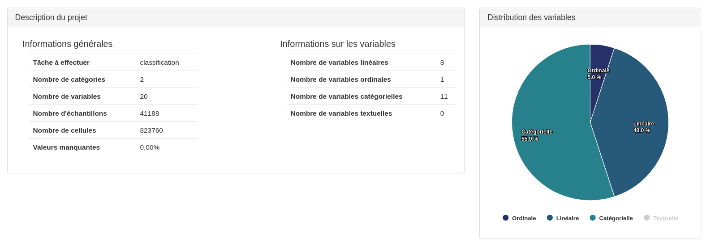
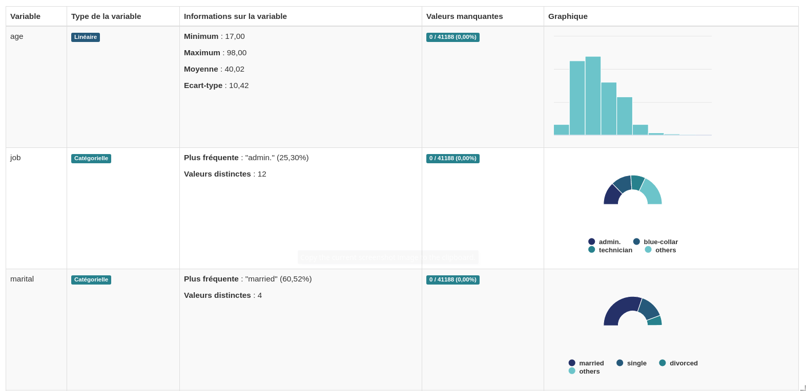
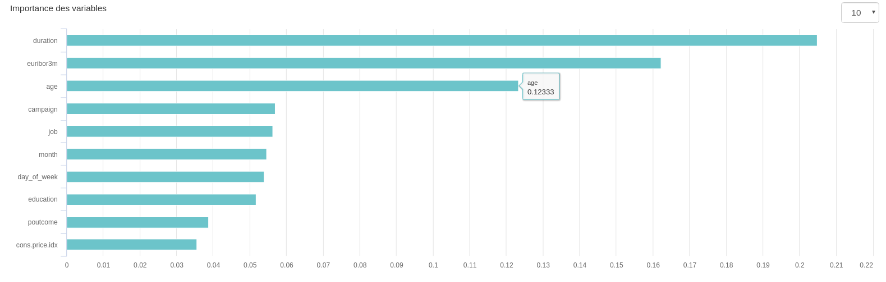
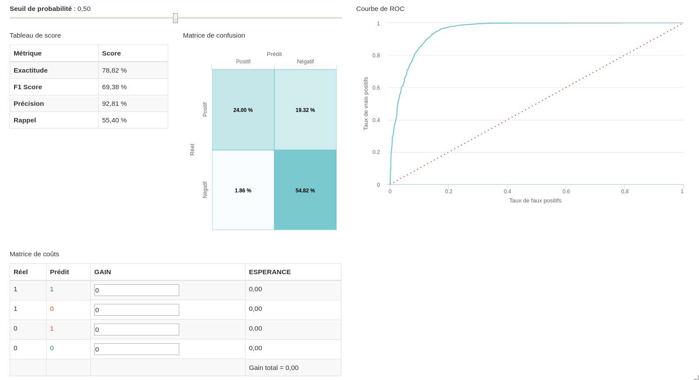
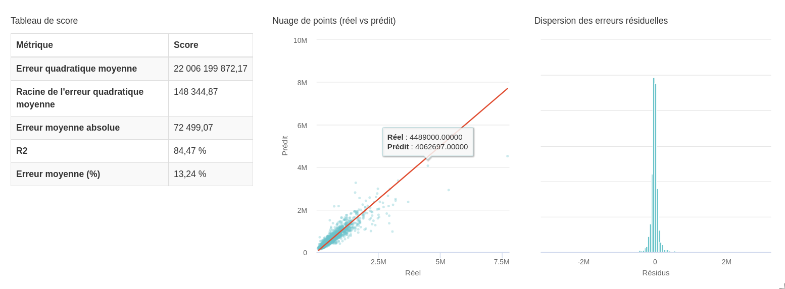
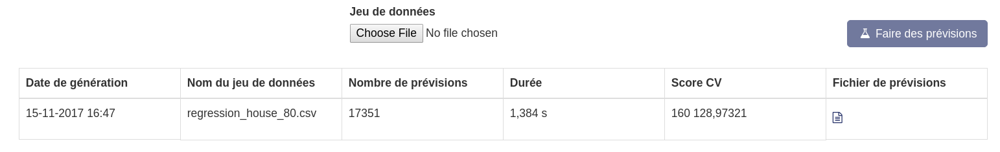

===========
Mes projets
===========

Une fois qu’un projet est créé, qu’il soit fini ou en cours de traitement vous pouvez visualiser les
performances du modèle et des statistiques sur les données en cliquant soit sur le nom du projet dans
le tableau de bord soit en cliquant dans le menu sur le bouton :

Dans la partie supérieure de ce tableau, vous pouvez choisir le projet de votre choix.
Pour chaque projet, l’écran détaille :

   * Une phase globale d’avancement : des cases grisées par défaut deviennent bleues dès que les tâches correspondantes sont déclenchées
   * Le nombre de modèles entraînés
   * L’estimateur d’erreur actuel ainsi que la métrique correspondant entre parenthèses.

Il est également possible d’arrêter le projet si celui-ci est en cours d’entraînement en appuyant sur
l’icône :

Si les calculs étaient finis, ce bouton change et permet la suppression du projet :

En dessous, 5 onglets vous permettent de choisir les différentes visualisations et d’effectuer des
prévisions.

Performance
-----------

Dès qu’un modèle est disponible, la courbe d’apprentissage s’affichera. Elle représente l’évolution de la
métrique en fonction du nombre de modèles. Cette courbe est décroissante car elle correspond
toujours à l’estimation d’une erreur. L’enveloppe autour de cette courbe représente un intervalle de
confiance.

Analyse des données
-------------------

Cet ongle affiche un certain nombre de statistiques calculées sur les données d’entrée.
Un tableau résume la tâche définie, puis des informations sur le jeu de données : nombre de catégories
de la cible, nombres de lignes et de colonnes, nombre de valeurs manquantes, etc...

La suite de la page affiche des statistiques et des visualisations par variable individuelle : nombre de
valeurs distinctes, corrélation avec la cible, valeurs moyenne, maximum, minimum, etc...

Importance des variables
------------------------

Une fois les premiers modèles calculés, un graphique d’importance relative des variables s’affiche, où
l’on peut voir quelles variables contribuent le plus à la performance du modèle.
Il est possible de choisir le nombre de variables à afficher grâce à la liste déroulante en haut à droite.
On prendra également soin de noter que cette liste varie en fonction du modèle. En effet, les modèles
étant différents, il est normal que la contribution des variables conditionnées au modèle soit également
différentes.

Analyse du modèle
-----------------

Enfin, l’onglet « Analyse du modèle » affiche des statistiques sur la performance du modèle entraîné.
Les types de données et de visualisations changent en fonction du type de tâche définie.

Classification binaire
~~~~~~~~~~~~~~~~~~~~~~

Pour une classification binaire, comme ci-dessous, on peut voir plusieurs scores de performance, ainsi
qu’une matrice de confusion, variant selon un seul de probabilité. Ainsi, vous pouvez définir le seuil
optimal en fonction de vos préférences (maximisation du F1-Score, du rappel...) Une matrice de coûts
est également affichée. Elle permet de savoir quel est l’espérance de gain associée à une prévision, sous
réserver de pouvoir quantifier les gains / pertes associés aux vrais positifs, faux positifs, faux négatifs et
vrais négatifs.
Sur la partie droite de l’écran se trouve une courbe de ROC, montrant la performance globale du
classifieur (plus d’infos : https://fr.wikipedia.org/wiki/Courbe_ROC)

Classification multi-classe
~~~~~~~~~~~~~~~~~~~~~~~~~~~

.. image:: _static/images/multiclassif_analysis_fr.png
   :scale: 100 %
   :alt: alternate text
   :align: center

Pour une classification avec plus de deux classes, nous retrouvons :

* Des métriques globales (macro = moyenne des scores pour chaque classe)
* Des métriques classes à classes
* Une courbe de ROC pour chaque classe
* Une matrice de confusion

Régression
~~~~~~~~~~

Pour un problème de régression, plusieurs scores de performances, en valeur relative ou absolue sont
représentés (RMSE, MAE, etc.)
Les deux graphiques représentent la dispersion des prédictions (gauche), (des points centrés autour de
la ligne représentant un modèle performant) et la distribution des erreurs (un histogramme resserré et
centré autour de 0 indiquant un modèle performant).

Faire des prévisions
--------------------

Pour accéder à l’écran permettant de réaliser des prévisions il vous faut cliquer dans l’onglet le plus à
droite
Dans cet écran, il vous suffit de cliquer sur le bouton « Parcourir » et d’y sélectionner un nouveau
fichier .CSV (ou un .ZIP le contenant). Il est impératif que celui-ci ait la même structure que le jeu
d’apprentissage, à l’exception de la colonne cible qui évidemment n’est pas présente dans le jeu de
données à prédire.
Une fois le fichier sélectionné, cliquez sur le bouton « Faire des prévisions » (à droite). A ce moment, les
données sont envoyées sur la plateforme et passent dans les modèles. Un fichier de prévisions .CSV
sous la forme (ID, TARGET) est généré et est mis à disposition dans le tableau en bas de l’écran. Vous
pouvez récupérer le fichier en cliquant sur le bouton
