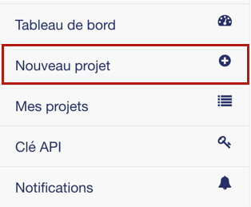
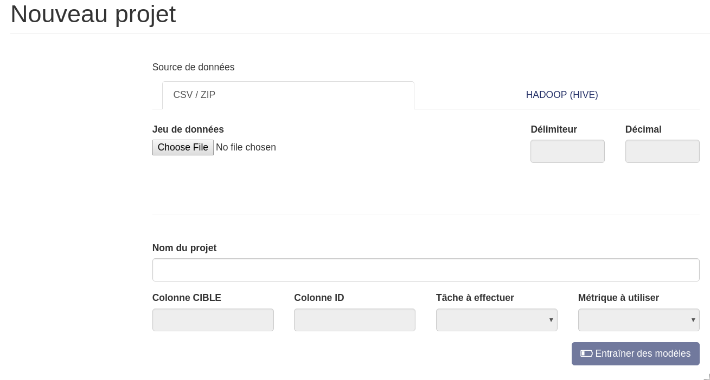
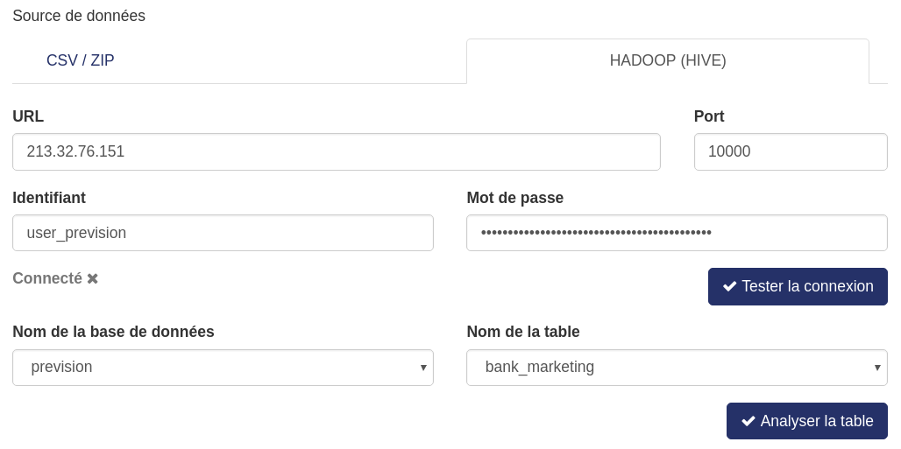
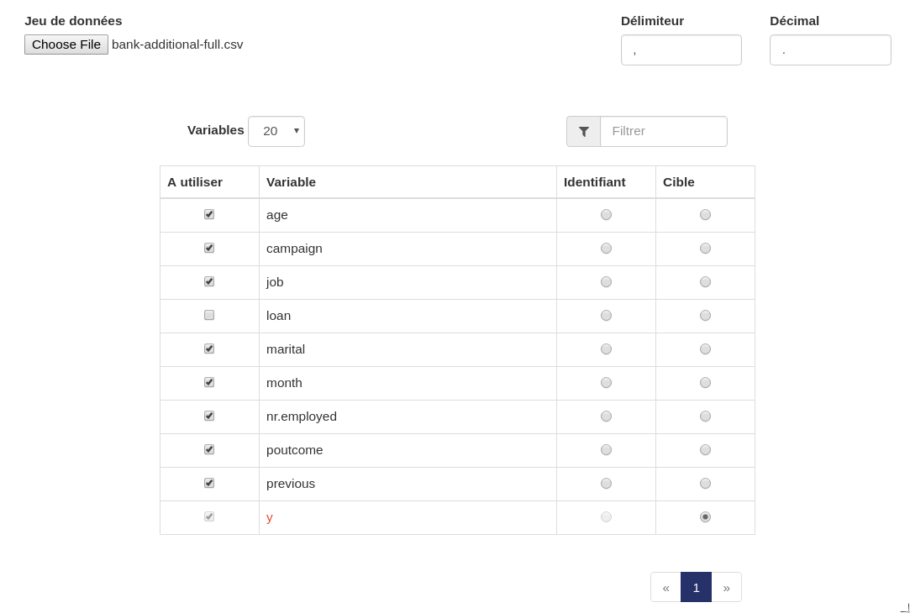
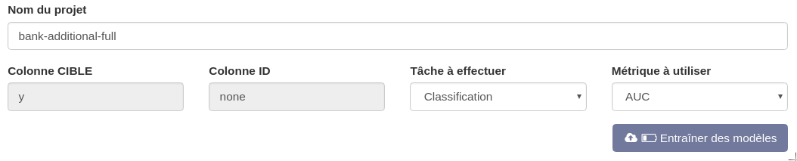

==============
Nouveau projet
==============

Afin de créer un nouveau projet, il faut vous rendre sur cet écran en cliquant sur le bouton :

Ou depuis le tableau de bord en cliquand sur le bouton "Nouveau projet".

Cet écran est composé en deux partie : la première permettant d’envoyer un jeu de données, via
différents type de connexions (ex : CSV, ZIP, HIVE, ...) La deuxième vous permet de choisir la cible à
prédire, l’éventuelle colonne ID et les variables à ne pas considérer.

Créer un nouveau projet via CSV / ZIP
-------------------------------------

Pour créer un nouveau projet, il vous faut uploader un fichier au format .CSV ou .ZIP (ne contenant qu’un
seul .CSV).

Nous détectons pour vous le délimiteur ainsi que le séparateur de décimales mais vous êtes libre de
l’ajuster. Dans la plupart des cas, les délimiteurs appropriés. Cependant, dans le cas de combinaisons complexes
ou peu courantes de délimiteurs de valeurs et décimaux, il est conseillé de vérifier :

* que les délimiteurs présents dans les champs en haut à droite sont ceux attendus
* que les noms de colonnes affichées plus bas sont aussi celles attendues

Créer un nouveau projet via HADOOP (HIVE)
-----------------------------------------

Si vous disposer de données dans HIVE, vous pouvez les importer dans Prevision.io via l’onglet
« HADOOP (HIVE) ».
Pour ce faire, il vous faut remplir l’URL, le port, l’identifiant et le mot de passe permettant d’accéder à
votre environnement.

Une fois ces informations renseignées, cliquer sur « Tester la connexion ». Une pop-up s’affiche. Si vous
êtes connectés vous pouvez alors renseigner le nom de la base de données puis le nom de la table. Une
fois que vous avez choisi quelle table charger, cliquer sur « Analyser la table ».

Configurer & démarrer votre projet
-------------------------------------

Une fois le fichier renseigné (ou la table chargée), un tableau contenant l’ensemble des variables
identifiées apparait :

* La première colonne correspond aux variables que l’on conserve. Par défaut, elles sont toutes conservées.
* La colonne « Identifiant » est facultative. Elle correspond à un identifiant technique (ex : clé primaire) qui ne sera pas utilisée pour l’entrainement en tant que variable mais qui doit être conservée, notamment pour la prédiction si l’on souhaite récupérer cette clé dans le fichier de résultat.
* La colonne « Cible » est obligatoire. Elle correspond à la variable que l’on souhaite prédire.

Finalement, il ne vous reste plus qu’à choisir un nom à votre projet. Par défaut, il est prérempli en
accord avec le nom de votre fichier puis vous pouvez éventuellement ajuster la tâche à effectuer et la
métrique, même si ces champs sont automatiquement renseignés en accord avec la cible que vous avez
sélectionnée.

Voici comment nous définissons les champs des deux dernières listes déroulantes :

* Tâche à effectuer :

    * Régression : si votre objectif est de prédire une variable quantitative
    * Classification : si votre objectif est de classifier dans 2 classes
    * Multi-Classification : si votre objectif est de classifier dans n classes (n > 2)

* Métrique à utiliser : métrique que vous souhaitez optimiser. Si vous ne savez pas quelle métrique choisir, nous vous recommandons d’utiliser la première proposée dans la liste déroulante.

Remarque : si votre jeu d’apprentissage contient une colonne nommée « ID » ou « TARGET », celles-ci
seront automatiquement détectées et choisies dans les menus correspondants.

Une fois toutes les informations renseignées vous pouvez cliquer sur le bouton « Entraîner des
modèles ». A ce moment, le jeu de données sera envoyé sur le serveur et l’entraînement commencera.
Vous pourrez alors suivre l’évolution de l’avancement.

-------------------------------------
 A propos de la détection automatique
-------------------------------------

Dans la plupart des cas, Prevision.io inférera correctement le type de tâche en fonction de la colonne cible choisie.
Cependant, certains cas ne sont pas détectables automatiquement, par exemple :

* Lorsque le problème est une régression, mais que la colonne cible ne contient qu'un faible nombre d'entiers, cela peut être détecté comme une multi-classification. Il faut alors ajuster le choix du problème en conséquence.
* Lorsque le problème est une régression et que les délimiteurs décimaux ne sont pas correctement détectés, les valeurs seront considérés comme des strings et la tâche détectée comme multi-classification.

