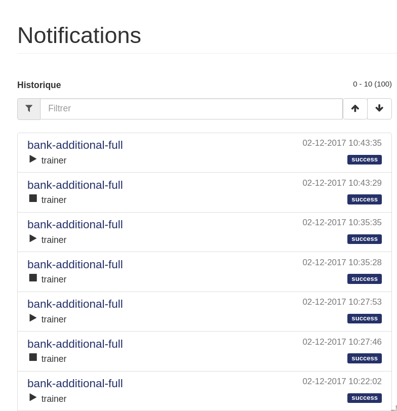

=============
Notifications
=============

Lorsque vous créez un projet ou que vous faites des prévisions, des notifications permettent de suivre
l’avancement des process. Celles-ci sont trouvables dans l’écran accessible en cliquant sur le bouton :
Les 100 dernières notifications sont répertoriées dans un tableau se lisant comme suit :

Chaque case représente une notification : début ou fin d’un process.
On y retrouve :

* Le nom du cas d’usage
* Si c’est une notification de début ou de fin de process
* La date d’émission de la notification
* Le statut : "success" ou "error".

Remarque : Il peut être intéressant de mettre « error » dans le champs filtre. Ainsi, seul les erreurs
seront remontées dans l’interface.
